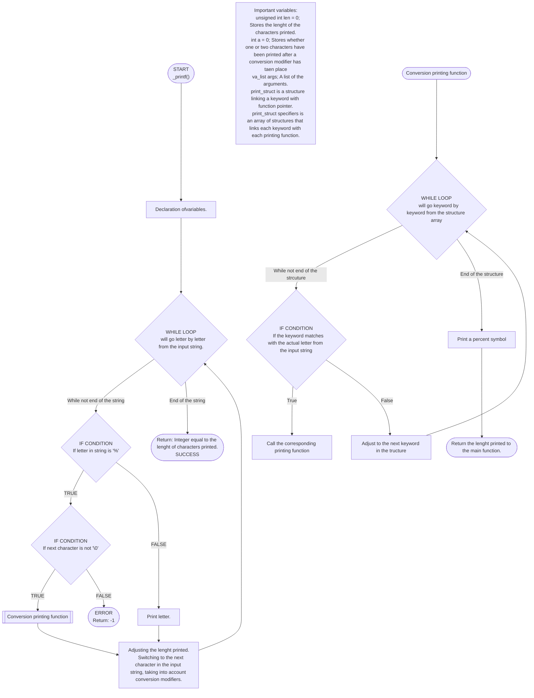

# _printf

## 🔖 Table of contents

<details>
  <summary>
    CLICK TO ENLARGE 😇
  </summary>
  📄 <a href="#description">Description</a>
  <br>
  📄 <a href="#flow-chart">Flow Chart</a>
  <br>
  🔨 <a href="#tech-stack">Tech stack</a>
  <br>
  📂 <a href="#files-description">Files description</a>
  <br>
  💻 <a href="#installation">Installation</a>
  <br>
  🔧 <a href="#whats-next">What's next?</a>
  <br>
  ♥️ <a href="#thanks">Thanks</a>
  <br>
  👷 <a href="#authors">Authors</a>
  </details>

## 📄 <span id="description">Description</span>

_printf() writes all the characters provided between double quotation marks. Moreover, it allows additional arguments to be converted and written at any desired position in the string of characters. To indicate the
	   position, a specific conversion modifier must be present. The conversion modifiers supported by this function
	   are the following:
          
- %c	Will take a char type variable and print a character.
              
- %s	Will take a char * type variable and print all the characters until but without including
			  		the null byte character.
              
- %d	Will take an int type variable and print it as a character(s).
              
- %i	Will take an int type variable and print it as a character(s).

- %u	Will take an unsigned int type variable and print it as character(s).

- %o	Will take an unsigned int type variable and print it in octal base as character(s).

- %x	Will take an unsigned int type variable and print it in hexadecimal base as character(s).

- %X	Will take an unsigned int type variable and print it in hexadecimal base (with capital letters) as character(s).
			  
- %%	Will just print a single percentage symbol.
			  
- %	If the follow up character is not included as a specific conversion modifier, the function will
			  		normally print both the percentage symbol and the follow up character, unless it is the Null byte,
					in which case it will result in an error.


 _printf() writes anything that is passed into it as long as its supported.
## 📄 <span id="flow-chart">Flow Chart</span>



## 🔨 <span id="tech-stack">Tech stack</span>

<p align="left">
  C Language Programming
</p>

## 📂 <span id="files-description">File description</span>

| **FILE**            | **DESCRIPTION**                                   |
| :-----------------: | ------------------------------------------------- |
| `_printf.c`       | File containing the main function                          |
| `conversion.c`     | Function that calls the appropriate printing function                       |
| `_putchar.c`      | Generic function to write a character |
| `print_char.c`      | Prints a character |
| `print_string.c`      | Prints a string of characters |
| `print_number.c`      | Prints a number in base 10 |
| `print_percent.c`      | Prints the % symbol |
| `print_unsigned.c`      | Prints an unsigned number |
| `print_octal.c`      | Prints a number in octal base |
| `print_hexa.c`      | Prints a number in hexadecimal base |
| `print_hexa_capital.c`      | Prints a number in hexadecimal number with capital letters |
| `main.h`      | Local library containing all the function prototypes |
| `README.md`       | The README file you are currently reading 😉.     |
| `man_3_printf`      | Manual file copy |
| `_printf.1`      | Manual file to be installed |

## 💻 <span id="installation">Installation</span>

1. Clone this repository:
  - Open your preferred Terminal.
  - Navigate to the directory where you want to clone the repository.
  - Run the following command:

```bash
git clone https://github.com/Yasi-Philippe/holbertonschool-printf.git
```

2. Open the repository you've just cloned.

3. In order to have access to the manual page copy the indicated file in the indicated adress with superuser powers:

```bash
sudo cp _printf.1 /usr/share/man/man1/
```

## 🔧 <span id="whats-next">What's next?</span>

- Add support for the following custom conversion specifiers:
    1. %b : converts a number to binary
  2. %S : prints a string of characters including non-printable characters displayed with their hexadecimal number
  3. %p : prints the address of a variable
  4. %r : prints a reversed string
  5. %R : prints a string of characters in rot13

- Add support for flag characters and lenght modifiers.
- Handle support for the field width, precision, flag characters 0 and -
    
- Create a local buffer of 1024 chars in order to call write as little as possible.
## ♥️ <span id="thanks">Thanks</span>

- Special thanks to the incredible instructors [Fabien Chavonet](https://github.com/fchavonet) and [Hugo Chilemme](https://github.com/hugo-chilemme)
## 👷 <span id="authors">Authors</span>

**Yasi Philippe Hübner**
- GitHub: [@Yasi-Philippe](https://github.com/Yasi-Philippe)
- LinkedIn: [@Yasi-Philippe](https://www.linkedin.com/in/yasi-philippe-hübner)

**Andric Assani**
- GitHub: [@Andric-Assani](https://github.com/Handroc)
- LinkedIn: [@Andric-Assani](https://www.linkedin.com/in/andric-assani)
